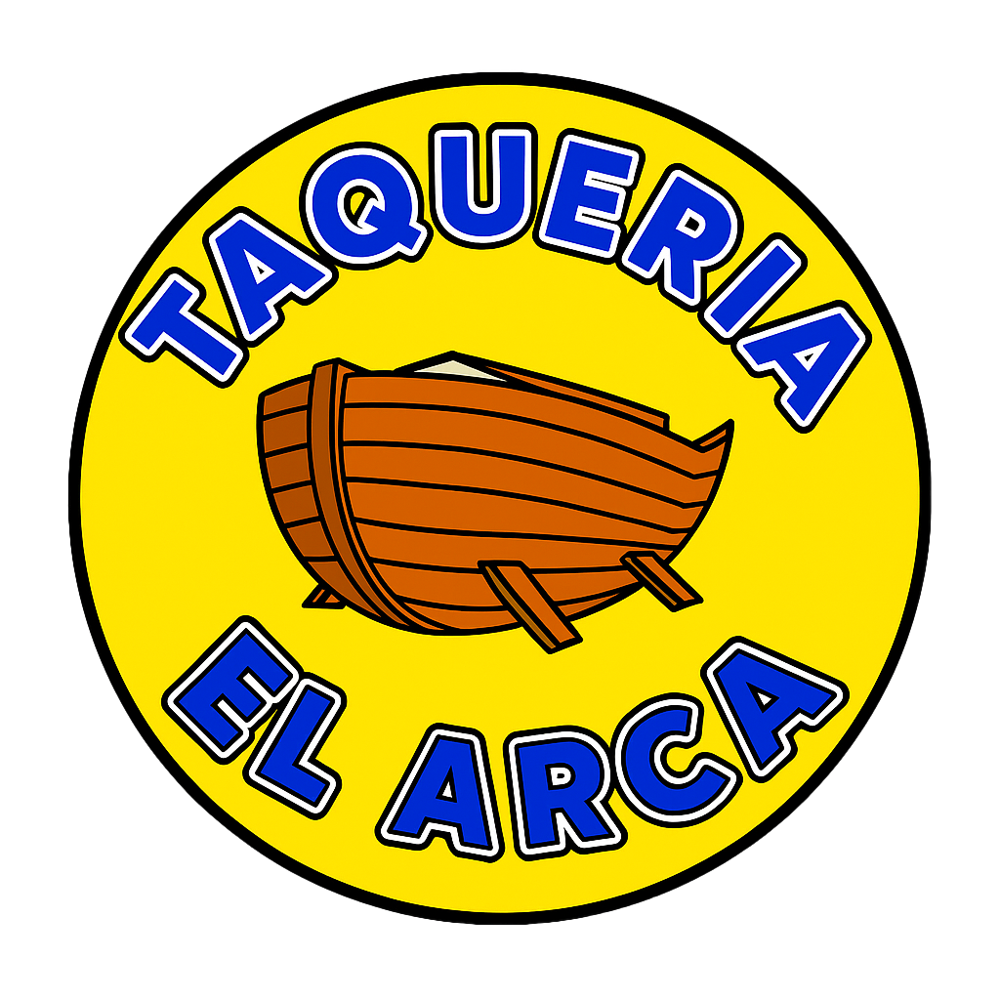

# ¡Hola! Soy Zamri Márquez Meléndez 👋

### 👩‍💻 TSU. en Tecnologías de la Información | Estratega Digital y Diseñadora Multimedia

---

### 🌟 Perfil Profesional

**TSU en Negocios Digitales.** Mi misión es clara: Impulsar el crecimiento empresarial de forma estratégica y visual. Combino la visión de negocio con la creatividad de alto impacto para transformar la presencia online.

**Mi Fórmula:** Estrategia, Diseño de Alto Impacto y Resultados Sólidos.

---

### 🛠️ Habilidades Técnicas y Creativas

| Categoría | Herramientas y Lenguajes | Énfasis en la Creatividad |
| :--- | :--- | :--- |
| **Diseño y Multimedia** | **Unity**, **Blender** (Animación 2D y 3D), **Paquetería Adobe** (Photoshop, Illustrator, Premiere, Audition) | Manejo experto de **Color** e **Imaginación**. |
| **Desarrollo Web y Datos** | PHP (desarrollo web), **Laravel**, **Python**, R Studio (Estadística y ML), Google Colab | Enfoque en optimización de procesos y UX/UI. |
| **Gestión** | Trello (organización y gestión de proyectos). | **Resiliencia** y **Trabajo en equipo**. |

---

### 🎨 Mis Proyectos Destacados en Diseño

Aquí te presento algunos ejemplos de mi trabajo creativo, donde mi imaginación y manejo del color cobran vida:

#### Flyer

  

Un flyer diseñado para la conversión y visibilidad mediante el manejo dinámico de color y la priorización de la información de contacto para generar presupuestos sin compromiso.

#### Targeta de Presentación

 
  
  

Diseño minimalista y profesional para una tarjeta de presentación, enfocándome en la legibilidad y la representación de la marca.

#### Logotipo

 
  
  

Identidad de marca distintiva para taquería. Diseño de símbolo que utiliza colores vibrantes para ser altamente reconocible y atractivo en el sector alimenticio.

---

### 💼 Trabajos Extras

Proyectos individuales y colaboraciones especiales que demuestran mi versatilidad creativa y técnica:

#### Video de publicidad
Producción de un video publicitario para apoyar la participación de una candidata del pueblo de San Pedro Tlalcuapan, destacando su mensaje, valores y compromiso comunitario mediante una presentación visual clara, dinámica y de alta calidad.
[Video publicitario](https://drive.google.com/file/d/1bUjf8d56WI4bLkxHb2pucDJQw03tZCn1/view?usp=sharing)

---

### 📈 Experiencia Previa

**La Colmena – Centro de Tecnologías Creativas (Trabajo en equipo)**

 **Desarrollo de proyectos de Realidad Aumentada para ferias.**
 [Ver Evidencia (Drive)](https://drive.google.com/drive/folders/11EKxWs2h-yYpakegkE7puvkA7t9RDN42?usp=sharing)
  *Narración:* Se realizó una aplicación de Realidad Aumentada para el recorrido de la Feria Geek, cuyo objetivo fue guiar a los visitantes, permitiendo visualizar la temática y actividades de cada estación.
     **Mi Contribución:** Fui responsable de la creación integral del personaje **"Babymixtle"**, desde el concepto, **modelado 3D** y diseño. Además, colaboré en las **animaciones**, el **doblaje de voz** del personaje, y parte del diseño del entorno 3D dentro de **Unity**.

 **Creación de experiencias de Realidad Virtual (Video juego de realidad aumentada sobre los órganos del cuerpo humano).**
  [Ver Evidencia (Drive)](https://drive.google.com/drive/folders/1F5icl04-nX8J9Nm6LDct2vuFnTO01c2-?usp=sharing)
    * *Narración:* Se desarrolló un videojuego de **Realidad Virtual** enfocado en la **educación infantil** para facilitar el aprendizaje sobre los órganos del cuerpo humano.
    * **Mi Contribución:** Realicé **modelados 3D** de algunas partes del cuerpo, creé el personaje **"ChibiAi"** desde cero (diseño, modelado y animaciones), diseñé parte del **entorno del consultorio** y creé **carteles de publicidad** para este trabajo.

* **Creación de videojuego 2D Pixel Art (Videojuego temática de terror).** [Ver Evidencia (Drive)](https://drive.google.com/drive/folders/15qub2vW7HdZ0e2IdX8vwLRxoz_UTT9f8?usp=sharing)
    * *Narración:* Se desarrolló un **videojuego 2D de Pixel Art con temática de terror**, enfocado en ofrecer una experiencia inmersiva a través de su estética visual y narrativa.
    * **Mi Contribución:** Fui responsable del **diseño de personajes 2D en estilo Pixel Art** desde cero, además de contribuir en la creación de los entornos y elementos visuales clave para establecer la atmósfera de terror.
---

### 🎓 Educación y Certificaciones

* **Título:** Técnico Superior en **Entornos Virtuales y Negocios Digitales**
> * Universidad Tecnológica de Tlaxcala

* **Certificaciones:**
> * Toma de decisiones basadas en datos: **Power BI** Santander X.
> * CertiProf, **Scrum Foundation Professional Certificate** SFPC.

---

## 📥 Descargar CV Completo

  Descargar mi CV(https://drive.google.com/file/d/1p31-w63VX_g8T8gPlZVyhCSNeNBYXzA1/view?usp=drive_link)

---

