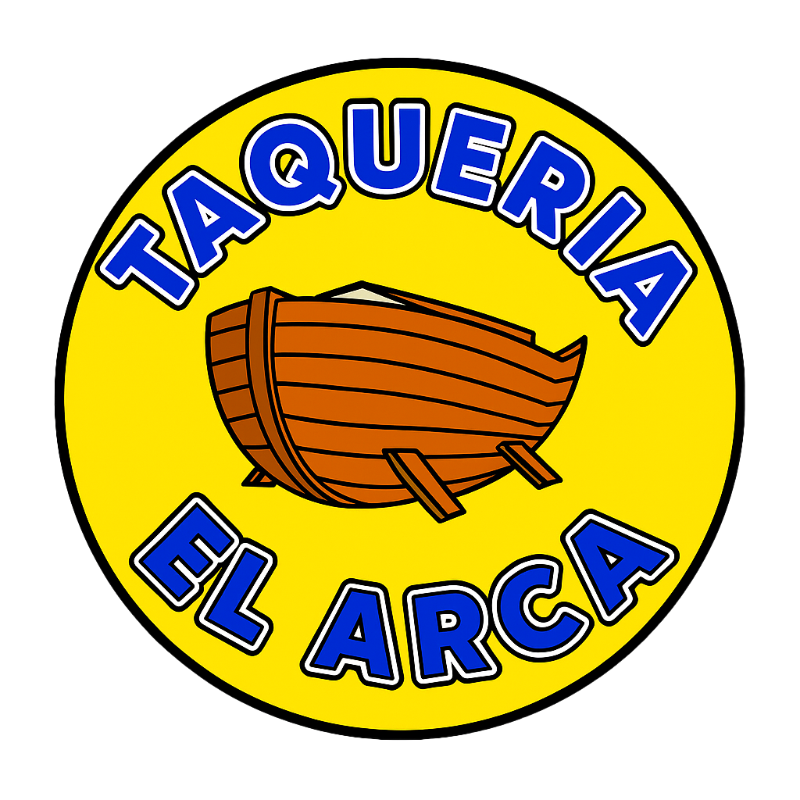

# ¡Hola! Soy Zamri Márquez Meléndez 👋

### 👩‍💻 TSU e Ingeniera en Entornos Virtuales y Negocios Digitales | Diseñadora Multimedia, Animadora y Estratega Digital

---

### 🌟 Perfil Profesional

**Ingeniera en Entornos Virtuales y Negocios Digitales.** Mi misión es impulsar el crecimiento empresarial integrando desarrollo técnico, producción audiovisual, animación, branding y marketing digital. Combino la visión estratégica de negocios con la creatividad de alto impacto para transformar la presencia online de marcas y proyectos.

**Mi Fórmula:** Estrategia, Branding/Diseño de Alto Impacto e Innovación con IA.

---

### 🛠️ Habilidades Técnicas y Creativas

| Categoría | Herramientas y Tecnologías | Énfasis |
| :--- | :--- | :--- |
| **Branding & Diseño** | **Adobe Photoshop**, **Adobe Illustrator**, **Figma**, Manuales de Identidad, Paletas de Color, Spine 2D, Pixel Art | Identidad corporativa, branding institucional, diseño web y gráfica publicitaria. |
| **Producción & Animación** | **Blender** (3D), **Adobe Premiere Pro**, **Adobe Audition**, **IA Generativa** (Video y Audio), Grabación en set | Animación 2D/3D, postproducción audiovisual y producción para ventiladores holográficos. |
| **Estrategia & Web** | Rediseño Web (UX/UI), **Benchmarking**, Análisis de Competencia, **Meta Ads** (Facebook Ads), Atención telefónica/directa | Estrategia digital de contenido, gestión de clientes y optimización de conversión. |
| **Desarrollo, XR y Datos** | **Unity** (AR/VR), PHP, **Laravel**, **Python**, R Studio, Google Colab, **GitHub**, HTML/CSS/JS | Creación de experiencias inmersivas e interactividad digital. |

---

### 📈 Experiencia Profesional & Estadías

#### 🏢 **HMH — Practicante / Estadías Profesionales**
* **Branding e Identidad Corporativa:** Elaboración completa del **Manual de Identidad Corporativa de la Marca** y del **Manual de Identidad de la Mascota** de la empresa.
* **Rediseño Web (UI/UX):** Actualización y modernización del sitio web oficial de la empresa, respetando y optimizando la paleta de colores e identidad de la marca.
* **Benchmarking & Análisis Estratégico:** Estudio comparativo de competidores con productos afines para la planificación y optimización de campañas publicitarias en redes sociales.
* **Publicidad Digital (Facebook & Meta Ads):** Creación, gestión y monitoreo de contenidos publicitarios enfocados en visibilidad y conversión.
* **Producción Audiovisual en Set & IA:** Apoyo técnico en grabaciones en set sobre la maquinaria industrial de la empresa y generación de contenidos en video apoyados con Inteligencia Artificial.
* **Atención y Gestión de Clientes:** Soporte directo y llamadas telefónicas a clientes para resolver inquietudes y dar seguimiento comercial.

---

### 🎨 Proyectos Destacados y Experiencia Previa

#### 🚀 **Proyectos Freelance & Trabajos Independientes**
* **Publicidad Holográfica 3D:** Creación y edición de videos optimizados para proyectores/ventiladores holográficos 3D, integrando **Adobe Premiere Pro** e **Inteligencia Artificial Generativa**.
* **Video Publicitario Político/Comunitario:** Producción audiovisual para apoyar la participación de una candidata en San Pedro Tlalcuapan.
  * 🎬 [Ver Video Publicitario en Google Drive](https://drive.google.com/file/d/1bUjf8d56WI4bLkxHb2pucDJQw03tZCn1/view?usp=sharing)

---

#### 🐝 **La Colmena – Centro de Tecnologías Creativas**

* **Desarrollo de Realidad Aumentada (Feria Geek):**
  * 📁 [Ver Evidencia en Drive](https://drive.google.com/drive/folders/11EKxWs2h-yYpakegkE7puvkA7t9RDN42?usp=sharing)
  * *Descripción:* Aplicación de RA para guiar a los visitantes a través de las estaciones de la feria.
  * **Mi Contribución:** Creación integral del personaje **"Babymixtle"** (concepto, modelado 3D y diseño), animación, doblaje de voz en **Adobe Audition** y apoyo en la integración de entornos 3D en **Unity**.

* **Videojuego Educativo en Realidad Virtual (Órganos del Cuerpo Humano):**
  * 📁 [Ver Evidencia en Drive](https://drive.google.com/drive/folders/1F5icl04-nX8J9Nm6LDct2vuFnTO01c2-?usp=sharing)
  * *Descripción:* Videojuego en VR enfocado en la educación infantil sobre anatomía humana.
  * **Mi Contribución:** Modelado 3D de órganos, creación completa del personaje **"ChibiAi"** (diseño, modelado y animaciones en Blender), diseño del entorno del consultorio y carteles publicitarios.

* **Videojuego 2D Pixel Art (Temática Terror):**
  * 📁 [Ver Evidencia en Drive](https://drive.google.com/drive/folders/15qub2vW7HdZ0e2IdX8vwLRxoz_UTT9f8?usp=sharing)
  * **Mi Contribución:** Diseño de personajes 2D en estilo Pixel Art desde cero, además de colaboración en el desarrollo de entornos y atmósfera inmersiva.

---

### 🖼️ Muestra de Trabajo Gráfico

 
#### Campaña publicitaria en HMH

*Diseño para campaña de publicidad en HMH, enfocado en maximizar visibilidad, conversión y presencia de marca en redes sociales.*
---

#### Tarjeta de Presentación

*Diseño minimalista y profesional con enfoque en legibilidad y representación de marca.*

---

#### Logotipo

*Identidad de marca con colores vibrantes y alta reconocibilidad para el sector alimenticio.*

---

### 🎓 Educación y Certificaciones

- 🎓 **Ingeniería / TSU en Entornos Virtuales y Negocios Digitales**
  > *Universidad Tecnológica de Tlaxcala*

- 📜 **Certificaciones:**
  > * **Scrum Foundation Professional Certificate (SFPC)** — *CertiProf*
  > * **Toma de decisiones basadas en datos: Power BI** — *Santander X*

---

### 📥 Descargar CV Completo

  📄 <a href="https://drive.google.com/file/d/1p31-w63VX_g8T8gPlZVyhCSNeNBYXzA1/view?usp=drive_link" target="_blank"><b>Haz clic aquí para descargar mi CV en PDF</b></a>

---

📬 **Contacto & Redes**
* 🌐 [GitHub Profile](https://github.com/Zammel4)
